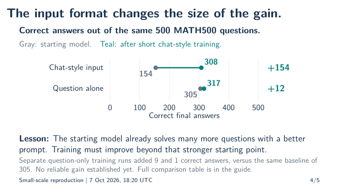
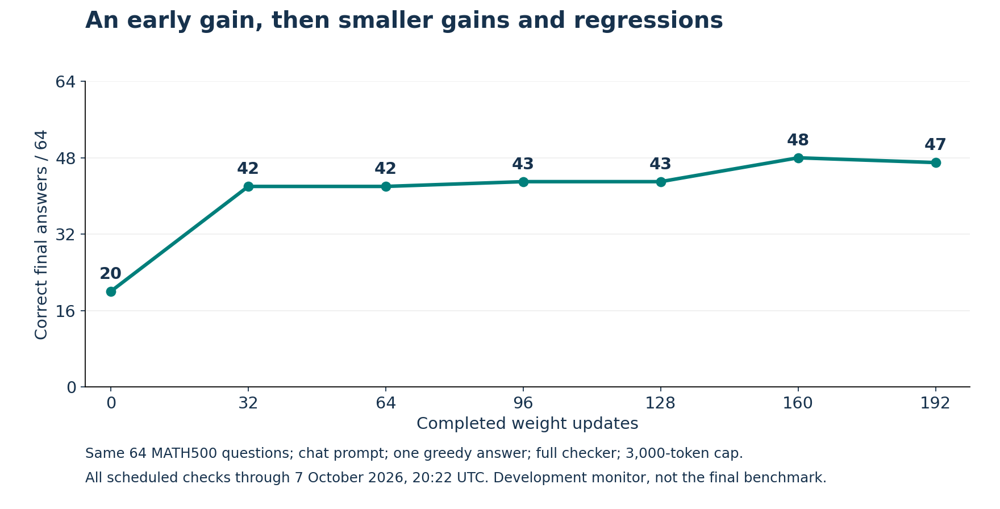

# Why we are training a language model to solve math

We ultimately want to train recursive language models to make better decisions: when to solve a problem directly, when to call a helper, and how to divide the work. Before attempting that complicated task again, we are practicing with a simpler, published example of reinforcement learning.

The immediate question is: **Can we take an existing language model, reward its correct math answers, and make it better on other math questions?**

We have a small-scale reproduction of RL-driven improvement: on the ongoing run's fixed 64-question monitor, correct answers rose from 20 to 47. The preceding check scored 48: progress includes regressions as well as gains. The main value is what this teaches us about creating a useful learning signal. The model needs reachable successes, a usable interface, varied attempts, and trustworthy feedback. A separate prompt comparison also shows why we must compare against a capable starting setup. The paper's full benchmark result is not yet reproduced.

Results below were checked through **7 October 2026, 20:22 UTC**. The smaller follow-up experiments described below are prepared but have not started.

For the next discussion, read the [research questions and possible blind spots](RESEARCH-QUESTIONS.md).
We are exploring several explanations and interventions, not committing to curriculum as the answer.
That portfolio distinguishes ready math follow-ups from RLM experiments that still need preparation.

## How this connects to our RLM research

An ordinary language model receives a question and writes an answer. A recursive language model, or RLM, can also use code to examine information and ask other model calls to solve smaller parts of a task.

For example, answering a question that connects two documents might require finding a person in the first document, looking up that person's organization in the second, and combining the two facts. An RLM could delegate those searches. We would like it to learn when that helps, what information to give each helper, and when further subdivision would waste time or lose important context.

Training those decisions introduces several possible failure points at once. Did the model choose a bad subtask? Did the helper receive too little information? Was the reward useful? Did training actually change the relevant behavior?

Math gives us a simpler place to learn how to answer the last two questions. This is a **method-reproduction exercise**, not yet a new RLM method or a claim of publishable novelty. A trustworthy training and evaluation procedure is useful groundwork for the later research.

## What the model is learning

We start with **Qwen2.5-Math-1.5B**, an already pretrained language model specialized for math. “1.5B” means roughly 1.5 billion numerical parameters, also called weights. Training changes those numbers; it does not rewrite the model's program by hand.

We use the authors' implementation of **Dr. GRPO**, a reinforcement-learning method from *Understanding R1-Zero-Like Training: A Critical Perspective*. Our experiments use one A100 GPU and a much smaller training budget than the published work. [Paper](https://arxiv.org/abs/2503.20783), [official code](https://github.com/sail-sg/understand-r1-zero/tree/dfca49dd460ee7cc8e4a5a162c876a7fd6993b87).

Here is the learning loop:

1. Give the model a training question and ask it for eight attempts.
2. Check each final answer against the known answer. Correct answers receive 1; incorrect answers receive 0. Answers cut off by the length limit receive 0.
3. Compare each attempt's score with the average for that question. Use those differences to adjust the weights toward successful attempts and away from unsuccessful ones.
4. Generate a new batch of attempts with the changed model, then repeat.

For a simple illustration, suppose a question asks `3x + 2 = 14`. If some attempts answer `x = 4` and others answer `x = 5`, the scores distinguish success from failure. If all eight attempts get the same score, that question supplies no relative learning signal in this method.

We do not add a stage of **supervised fine-tuning (SFT)** in which the model copies worked solutions. It generates its own attempts and learns from their scores. It does, however, bring substantial knowledge from pretraining.

## Why curriculum and exploration might help

For this group-relative method, useful contrast occurs **within the attempts on one question**. Eight wrong answers give eight zeros; eight correct answers give eight ones. In both cases, subtracting the group's average leaves zero. Mixing always-solved easy questions with never-solved hard questions does not fix this, even if overall accuracy is 50%.

This motivates a curriculum: practice tasks the current model can sometimes solve, then adjust difficulty as its ability changes. That is a proposed training strategy, not something our math experiment has tested. Mixed rewards make learning possible; they do not guarantee correct credit assignment or useful generalization. Other RL objectives can obtain signals in other ways.

More attempts may reveal rare successes. If independent attempts each succeeded 1% of the time, eight would give about a 7.7% chance of finding any success, versus 27.5% with 32. Actual attempts may be highly similar. Increasing temperature can produce alternative approaches but also invalid code. More attempts also leave less compute for other training questions. Keep evaluation attempts fixed when measuring training gains.

For an RLM, diagnose the obstacle before choosing the intervention:

| Observed behavior | Candidate intervention |
| --- | --- |
| Tool calls do not execute | Clear API examples or SFT on verified tool use |
| Calls work but all answers fail | Easier tasks, better context passing, teacher demonstrations, or a stronger model |
| Occasional successes appear | More attempts or a modest sampling change to expose useful alternatives |
| Both successes and failures appear, but RL does not improve | Audit rewards, credit assignment, and updates |
| Nearly every attempt succeeds | Harder tasks or gradually remove assistance |

Imagine a biography names a scientist's employer and another document gives its city. Correct syntax is only the first step: the model must pass the employer's name to the next lookup. This separates learning **how to use the tools** from learning **what useful work to assign**. Demonstrations could help with both; RL would then need to improve beyond the demonstrations alone. A direct answer remains appropriate when delegation is unnecessary.

Our next RLM question is: **Does teaching basic skills in sequence make subsequent RL of decomposition more effective?** Compare prompt examples alone, staged SFT on verified RLM demonstrations, and SFT on the same examples shuffled. Match exposure across the two SFT arms, keep helper models fixed, and compare each setup before and after the same RL budget. This separates the value of demonstrations from the value of their order.

The proposed sequence is **read a real Python result → make one valid helper call → connect dependent calls → choose a strategy without hints**. Measure existing skills first, gradually remove assistance, and retain some earlier practice. Test new combinations of skills, not merely longer documents of one familiar kind. These are proposed experiments, not RLM results already established by the math reproduction.

## Closely related ideas from the literature

The human-learning analogy suggests a hypothesis, not proof that models need a particular teaching order. Several primary sources offer more direct motivation:

- **Useful reward contrast:** [DAPO, section 3.2](https://arxiv.org/html/2503.14476v1) filters out response groups that are all correct or all wrong. That is a direct connection to our observation. It is adaptive selection, not evidence that our proposed skill sequence is best; discarded generations still cost compute.
- **Learning the RLM interface:** [Recursive Language Models, version 3](https://arxiv.org/html/2512.24601v3) describes fine-tuning Qwen3-8B on 1,000 filtered RLM demonstrations, focusing on the root model's environment use and recursive calls. Its separate RL experiment also reports transfer from shorter to longer retrieval tasks. The broad idea of training an RLM is therefore already established; our question must be narrower.
- **Supervised preparation before RL:** [DeepSeek-R1, section 2.3.1](https://arxiv.org/html/2501.12948v1) uses a small cold-start dataset before RL. R1-Zero omits that stage. This motivates comparing preparation choices rather than declaring SFT universally necessary.
- **Bootstrapping successful demonstrations:** [STaR](https://arxiv.org/abs/2203.14465) iteratively generates and filters solution rationales for fine-tuning. For us, an analogous idea would collect verified RLM trajectories. That adaptation would require checking actual execution and useful behavior, not trusting plausible-looking traces.

The potential research contribution is not “SFT then RL” by itself. It is evidence about **which skills, which teaching order, and which readiness measurements lead to better RL and transfer to new task combinations**. This targeted literature check motivates the experiment; it is not an exhaustive novelty review.

## How this builds on our earlier experiments

Our [earlier research audit](../research-audit-2026-09-29/early-history.md) already
records successful SFT of executable routines, alongside weaker transfer to
flexible orchestration. We should not rewrite that history as “we never taught
the basics.” The stronger hypothesis is that we did not reliably bridge the
gap between local skills and choosing, combining, and recovering those skills
in whole tasks. These are historical audited findings, not new remeasurements.

The curriculum should therefore begin with a skill check. Skip abilities the
model already has; concentrate teaching on demonstrated gaps. Compare staged
and shuffled exposure to the same examples, and include a test where familiar
skills must be combined in an unfamiliar way. A fixed data mix may work just as
well; that outcome would favor simpler training over a complex curriculum.

## How we tell whether it improved

Training performance is not enough. The model might improve only on questions it has already practiced, or become better at formatting an answer without becoming better at solving the problem.

Our main evaluation is **MATH500**, a collection of 500 math questions excluded from our weight training. A score of 308/500 means that one generated final answer was accepted on 308 questions, or 61.6%. We use the same mathematical answer checker and response-length limit when comparing models.

We also repeatedly check a fixed subset of 64 questions during the longer run. Those checks show its progress, but they are not 64 independent training experiments. We have already inspected this benchmark while deciding what to try, so it is not an untouched final test.

We evaluate two input formats:

- **Chat style:** put the question in a conversation, with an instruction to reason step by step and mark the final answer.
- **Question alone:** supply the original question without that surrounding conversation.

Both ask for the same mathematical answer. Surprisingly, the original model performs much better with the question alone.

## What the completed experiments taught us

We ran short experiments with 512 training questions and 32 weight updates, starting from the original model each time. One trained with chat-style questions. Two trained with questions alone; the second was a fresh repeat, not another evaluation of the same trained model.

| Model tested | Chat-style test, correct out of 500 | Question-only test, correct out of 500 |
| --- | ---: | ---: |
| Original model | 154 | 305 |
| After chat-style training | 308 | 317 |
| After question-only training | 168 | 314 |
| Fresh repeat of question-only training | 166 | 306 |

Read down a column to compare training while keeping the test prompt fixed. Read across a row to compare prompts while keeping the model weights fixed.

The headline chat-style gain is large: **154 to 308 correct**. But the original model already answered 305 correctly with the question alone. In that stronger test format, the chat-trained model improved from **305 to 317**, just 12 more answers.

The other training approach also gave small gains: 305 to 314, then 305 to 306 in the repeat. These results do not establish a dependable, substantial improvement beyond the stronger starting setup.

**Lesson:** a weak starting prompt can make training look more transformative than it is. This does not prove that all gains are prompt repair, or that RL cannot teach useful behavior. It tells us which baseline we must take seriously. The paper itself emphasizes this concern.

## What the longer run is showing

The ongoing run starts from the original model and is scheduled to train on 4,080 usable questions for 255 weight updates. It also uses the full answer checker during training, whereas the earlier short runs used a faster checker. It therefore tests a revised recipe, not training duration alone.

Its fixed 64-question progress checks are:

| Completed weight updates | 0 | 32 | 64 | 96 | 128 | 160 | 192 |
| --- | ---: | ---: | ---: | ---: | ---: | ---: | ---: |
| Correct answers out of 64 | 20 | 42 | 42 | 43 | 43 | 48 | 47 |

The early gain persists, but the latest point falls by one: one answer improved and two became wrong. A sine-product answer recovered; polygon-perimeter and square-table counting answers regressed. The latter incorrectly used a circular-table formula. This illustrates why we retain the entire curve instead of selecting its highest point. One small decline does not establish a worsening trend, just as a flat stretch did not establish a permanent limit.

The latest 47/64 is 73.44%. **It is not a full 500-question score**, and approaching the paper's percentage on this smaller set is not reproducing its benchmark result.

Three earlier attempts failed because of memory or initialization problems. They remain failures, not benchmark scores. The current attempt uses an isolated memory-saving repair and saves model and optimizer checkpoints frequently. At the latest check, training rewards agreed with independent grading and the numerical updates were finite. Those checks support training correctness, but do not themselves establish improved math ability.

## How far are we from the paper

For the same 1.5B model size, the paper reports **33.0% before training and 74.2% after training** with the chat template. Its stronger question-only base scores **61.8%**. Thus the trained model exceeds that stronger starting score by 12.4 percentage points, although the input formats differ. [Paper, Tables 1 and 4](https://arxiv.org/html/2503.20783v2#A2).

Our completed short chat-style result is 61.6%; the longer run's full benchmark result is still pending. We also downloaded the authors' already-trained model and obtained **73.2%** in our evaluator. That is close to their 74.2%, with an unexplained five-answer difference. It is a useful check of the evaluator, **not evidence that our training achieved their result**.

## What we will try next and why

The current longer run will finish its fixed budget, then evaluate the final model on all 500 questions and two other math collections: AMC and Minerva. Those additional collections test whether any gain extends beyond MATH500. They do not test RLM delegation.

For subsequent exploration, speed now takes priority. We have prepared three shorter runs on the same 512 training questions, with the same fixed 128-question evaluation:

| Experiment | What changes | What it can teach us |
| --- | --- | --- |
| Small control | Keep the current learning settings | Establish a matching reference for this smaller dataset. |
| Larger learning steps | Increase the learning rate fivefold | Are the current updates too cautious to help much within a short run? |
| More learning from each batch | Make two learning passes instead of one | Can we learn more from the same generated attempts? |

Every run starts from the original model. The first two make 32 weight updates; the extra-pass run makes 64 using the same number of sampled attempts. We will report all three outcomes, not just whichever looks best.

Small tests are noisier, but they let us reject unhelpful ideas sooner. A promising result should earn an independent training repeat and a larger evaluation. We will use each run's prescribed final checkpoint rather than choosing its most favorable intermediate score.

## A concrete lesson for the eventual RLM

The model sometimes writes code and then invents what that code would print. In one saved answer, it claimed that `m = 28, n = 11` satisfied `3m + 4n = 100`. Substitution gives **128**, not 100.

This experiment generates text; it does not execute the model's code. A plausible-looking program and a claimed output are not proof that a calculation actually happened. The answer checker marked this answer wrong, but it does not verify every step of every explanation.

An RLM could execute the calculation and inspect the real result. Our later work must test whether it uses that feedback productively, not merely whether its explanations look convincing. The [learning guide, page 10](learning-guide.pdf) walks through this example and a probability question that improved.

The goal is to return to RLM training with a clearer understanding of useful rewards, effective updates, honest baselines, and reliable evaluation. We are making progress on that foundation. A strong new RLM research claim still requires its own experiments.

## Where to read next

- [Six-slide overview](../../slides/2026-10-07-r1-replication/research-update.pdf): the reproduction, lessons and proposed RLM experiments.
- [Detailed learning guide](learning-guide.pdf): worked examples and a fuller explanation of the experiments.
- [Latest checked evidence](interim-monitor-2022.json): exact counts, saved-result identifiers, checks and limitations.
- [Research record](README.md): the chronological account, including unsuccessful attempts and earlier findings.
